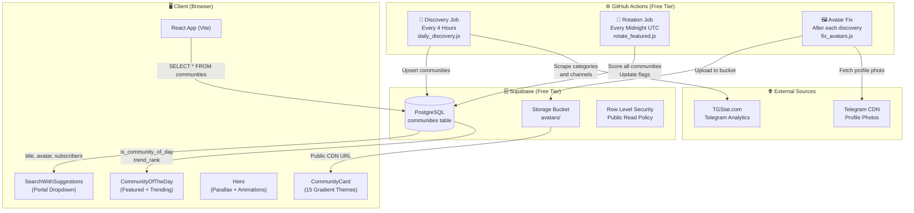
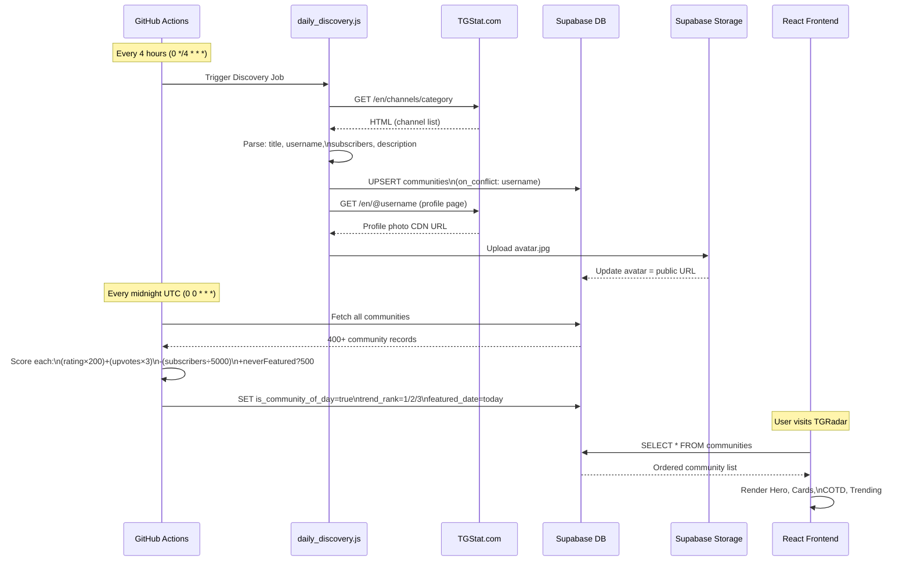
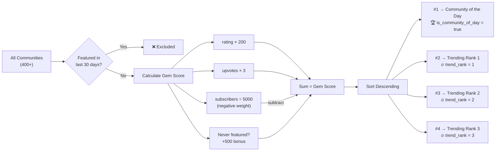
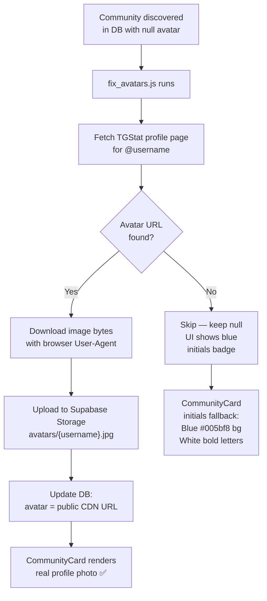

# TGRadar — Verified Telegram Community Discovery Platform

<div align="center">


**The Verified Multiverse of Telegram Communities**

[](https://github.com/Satyabrat99/TGRadar)
[](https://supabase.com)
[](/.github/workflows/daily_discovery.yml)
[](LICENSE)

*Discover 400+ curated Telegram channels, groups, bots, and Web3 communities — automatically indexed, verified, and surfaced daily.*

</div>

---

## 📖 Table of Contents

- [Overview](#-overview)
- [Features](#-features)
- [Tech Stack](#-tech-stack)
- [Architecture](#-architecture)
- [Data Flow](#-data-flow)
- [Automation Engine](#-automation-engine)
- [Hidden Gem Algorithm](#-hidden-gem-algorithm)
- [Avatar Pipeline](#-avatar-pipeline)
- [Database Schema](#-database-schema)
- [Project Structure](#-project-structure)
- [Getting Started](#-getting-started)
- [GitHub Actions Setup](#-github-actions-setup)
- [Environment Variables](#-environment-variables)
- [Roadmap](#-roadmap)

---

## 🌐 Overview

TGRadar is a **zero-cost, fully automated** Telegram community discovery platform. It crawls TGStat (a leading Telegram analytics site) every 4 hours, indexes new communities into a Supabase PostgreSQL database, downloads and stores real profile avatars, and uses a proprietary **Hidden Gem Algorithm** to surface lesser-known but high-quality communities daily.

The entire infrastructure runs on **GitHub Actions** (free tier) + **Supabase** (free tier) — no servers, no cost, fully serverless.

---

## ✨ Features

| Feature | Description |
|---|---|
| 🔍 **Smart Search** | Real-time autocomplete with trending suggestions and text highlighting |
| 🏆 **Community of the Day** | Daily hidden gem surfaced by engagement score algorithm |
| 🔥 **Trending Leaderboard** | Top 3 communities ranked by the hidden gem algorithm |
| 🗂️ **Category Browse** | 10 major domains with nested subcategory filtering |
| 🤖 **Auto Discovery** | Crawls TGStat every 4 hours for new communities |
| 🖼️ **Avatar Pipeline** | Downloads real Telegram profile photos to Supabase Storage |
| 💾 **Bookmarks** | Client-side bookmark drawer with persistent state |
| 📤 **Submit Community** | User-submitted community intake form |
| 🎨 **15 Gradient Themes** | Premium card gradients assigned deterministically per community |
| 🎭 **Animated Hero** | Parallax mouse tracking, floating elements, staggered entrance animations |

---

## 🛠 Tech Stack

```
┌─────────────────────────────────────────────────────┐
│                    FRONTEND                         │
│  React 18  ·  Vite  ·  Tailwind CSS  ·  Lucide Icons│
└─────────────────────────────────────────────────────┘
          │
          ▼
┌─────────────────────────────────────────────────────┐
│                    BACKEND / DB                     │
│  Supabase PostgreSQL  ·  Supabase Storage (avatars) │
│  Supabase Realtime  ·  Row Level Security           │
└─────────────────────────────────────────────────────┘
          │
          ▼
┌─────────────────────────────────────────────────────┐
│                   AUTOMATION                        │
│  GitHub Actions  ·  Node.js Scripts                │
│  TGStat Crawler  ·  Daily Rotation Engine           │
└─────────────────────────────────────────────────────┘
```

### Detailed Stack

| Layer | Technology | Purpose |
|---|---|---|
| **UI Framework** | React 18 + Vite | Component rendering, HMR, fast builds |
| **Styling** | Tailwind CSS + Vanilla CSS | Utility-first design system |
| **Icons** | Lucide React | Consistent icon library |
| **Database** | Supabase PostgreSQL | Community data storage and querying |
| **File Storage** | Supabase Storage | Avatar image CDN |
| **Auth/RLS** | Supabase RLS Policies | Row-level security for public read |
| **Crawler** | Node.js + Fetch API | TGStat scraping with browser-like UA |
| **CI/CD** | GitHub Actions | Free automated cron execution |
| **Portal Rendering** | React DOM `createPortal` | Dropdown escaping overflow:hidden |
| **State** | React `useState` / `useMemo` | Local state, computed communities |

---

## 🏗 Architecture



---

## 🔄 Data Flow



---

## ⚙️ Automation Engine

The automation runs entirely on **GitHub Actions free tier** with two independent jobs:

```mermaid
gantt
    title TGRadar Daily Automation Timeline (UTC)
    dateFormat HH:mm
    axisFormat %H:%M

    section Discovery (every 4h)
    Crawl + Ingest    :00:00, 30m
    Crawl + Ingest    :04:00, 30m
    Crawl + Ingest    :08:00, 30m
    Crawl + Ingest    :12:00, 30m
    Crawl + Ingest    :16:00, 30m
    Crawl + Ingest    :20:00, 30m

    section Rotation (once daily)
    Hidden Gem Rotation :00:00, 5m
```



### Cron Schedules

```yaml
# Discovery: indexes new Telegram communities
- cron: '0 */4 * * *'   # 00:00, 04:00, 08:00, 12:00, 16:00, 20:00 UTC

# Rotation: picks new featured + trending communities
- cron: '0 0 * * *'     # Midnight UTC only
```

---

## 💎 Hidden Gem Algorithm

The daily rotation uses a proprietary scoring algorithm that **deprioritizes giant channels** and **rewards engaged hidden gems**:



**Formula:**
```
gem_score = (rating × 200) + (upvotes × 3) - (subscribers ÷ 5000) + (never_featured ? 500 : 0)
```

This ensures:
- A small channel with rating `4.9` and `500 upvotes` beats a massive `10M member` channel with lower engagement
- Communities rotate every 30 days minimum — no repeats
- New communities get a `+500` first-time bonus to help them get discovered

---

## 🖼️ Avatar Pipeline



**Fallback chain in `CommunityCard.jsx`:**
```
1. avatar (Supabase CDN URL)  → show real photo
2. image load error           → onError triggers fallback
3. null/empty avatar          → instantly render initials badge
   └── Blue #005bf8 background + white bold initials (e.g. "BH", "EH")
```

---

## 🗄️ Database Schema

```sql
CREATE TABLE public.communities (
    id              TEXT PRIMARY KEY,
    title           TEXT NOT NULL,
    username        TEXT UNIQUE NOT NULL,
    description     TEXT,
    type            TEXT DEFAULT 'channel',      -- channel | group | bot
    category        TEXT NOT NULL,               -- Web3 & Crypto | Tech & Dev | etc.
    subscribers     BIGINT DEFAULT 1000,
    language        TEXT DEFAULT 'English',
    verified        BOOLEAN DEFAULT true,
    activity        TEXT DEFAULT 'Active',
    safety_score    INT DEFAULT 98,
    rating          NUMERIC(3,2) DEFAULT 4.8,
    tags            TEXT[] DEFAULT '{}',
    avatar          TEXT,                         -- Supabase Storage public URL
    banner_bg       TEXT,                         -- CSS gradient string
    link            TEXT,                         -- t.me/username
    upvotes         INT DEFAULT 1,
    is_community_of_day BOOLEAN DEFAULT false,    -- Today's featured pick
    featured_date   DATE,                         -- Last date featured/trending
    trend_rank      INT DEFAULT 0,                -- 1/2/3 = trending, 0 = normal
    created_at      TIMESTAMP WITH TIME ZONE DEFAULT CURRENT_TIMESTAMP
);

-- Performance indexes
CREATE INDEX idx_communities_category     ON public.communities(category);
CREATE INDEX idx_communities_subscribers  ON public.communities(subscribers DESC);
CREATE INDEX idx_communities_is_cotd      ON public.communities(is_community_of_day);
CREATE INDEX idx_communities_trend_rank   ON public.communities(trend_rank);
CREATE INDEX idx_communities_featured_date ON public.communities(featured_date);
```

---

## 📁 Project Structure

```
TGRadar/
├── .github/
│   └── workflows/
│       └── daily_discovery.yml     # GitHub Actions: discovery (4h) + rotation (daily)
│
├── scripts/
│   ├── daily_discovery.js          # TGStat crawler + Supabase ingest
│   ├── fix_avatars.js              # Retroactive avatar download pipeline
│   └── rotate_featured.js          # Hidden gem daily rotation engine
│
├── src/
│   ├── components/
│   │   ├── Hero.jsx                # Animated hero with parallax + search
│   │   ├── SearchWithSuggestions.jsx # Portal-based autocomplete dropdown
│   │   ├── CommunityCard.jsx       # Card with gradient + avatar fallback
│   │   ├── CommunityOfTheDay.jsx   # Featured + trending leaderboard
│   │   ├── CommunityGrid.jsx       # Paginated community grid (20 + view more)
│   │   ├── IndustrySpotlight.jsx   # Category browse with subcategories
│   │   ├── FilterBar.jsx           # Search/filter bar for community grid
│   │   ├── CommunityModal.jsx      # Quick-view modal
│   │   ├── BookmarksDrawer.jsx     # Slide-in bookmarks panel
│   │   ├── SubmitModal.jsx         # Community submission form
│   │   ├── Navbar.jsx              # Top navigation bar
│   │   ├── Footer.jsx              # Site footer
│   │   └── ui/                     # Reusable UI primitives
│   │       ├── Badge.jsx
│   │       ├── VerifiedBadge.jsx
│   │       └── ActionButton.jsx
│   │
│   ├── data/
│   │   ├── communities.js          # Seed/fallback community data
│   │   └── categoryHierarchy.js    # Category → subcategory tree
│   │
│   ├── lib/
│   │   └── supabase.js             # Supabase client singleton
│   │
│   ├── utils/
│   │   └── telegramAvatar.js       # 15 premium gradients + avatar resolver
│   │
│   ├── styles/
│   │   └── theme.css               # Global design tokens
│   │
│   ├── App.jsx                     # Root component + state management
│   └── main.jsx                    # React entry point
│
├── supabase/
│   ├── schema.sql                  # Full DB schema + RLS policies
│   └── migration_add_rotation_columns.sql  # featured_date + trend_rank migration
│
├── public/
│   ├── favicon.svg
│   ├── gold-verify.png
│   └── verify.png
│
├── index.html
├── vite.config.js
├── tailwind.config.cjs
└── package.json
```

---

## 🚀 Getting Started

### Prerequisites
- Node.js 18+
- A [Supabase](https://supabase.com) account (free tier works)

### 1. Clone the repository
```bash
git clone https://github.com/Satyabrat99/TGRadar.git
cd TGRadar
```

### 2. Install dependencies
```bash
npm install
```

### 3. Set up Supabase

1. Create a new project at [supabase.com](https://supabase.com)
2. Run the schema in **SQL Editor**:
```bash
# Copy contents of supabase/schema.sql into Supabase SQL Editor
# Then run the migration:
# Copy contents of supabase/migration_add_rotation_columns.sql
```

### 4. Create environment file
```bash
cp .env.example .env
```

Edit `.env`:
```env
VITE_SUPABASE_URL=https://your-project.supabase.co
VITE_SUPABASE_ANON_KEY=your-anon-key-here
```

### 5. Run development server
```bash
npm run dev
```

Visit `http://localhost:5173` 🎉

### 6. Run the crawler manually (optional)
```bash
# Discover and index communities
node scripts/daily_discovery.js

# Fix missing avatars
node scripts/fix_avatars.js

# Run today's hidden gem rotation
node scripts/rotate_featured.js
```

---

## 🤖 GitHub Actions Setup

The automation runs free on GitHub Actions. After pushing to GitHub:

1. Go to **Settings → Secrets and variables → Actions**
2. Add the following secrets:

| Secret Name | Value |
|---|---|
| `SUPABASE_URL` | Your Supabase project URL |
| `SUPABASE_ANON_KEY` | Your Supabase anon/public key |

3. The workflows will automatically run on schedule:
   - **Discovery**: every 4 hours → indexes ~50 new communities/day
   - **Rotation**: every midnight UTC → picks new hidden gems

You can also trigger manually from **Actions → TGRadar Automated Engine → Run workflow**.

---

## 🔐 Environment Variables

| Variable | Required | Description |
|---|---|---|
| `VITE_SUPABASE_URL` | ✅ | Your Supabase project URL |
| `VITE_SUPABASE_ANON_KEY` | ✅ | Supabase anonymous (public) key |

> **Note:** Never commit `.env` to git. It's already in `.gitignore`.

---

## 🗺 Roadmap

- [ ] **User Authentication** — Supabase Auth for personalized bookmarks
- [ ] **Community Ratings** — User-submitted ratings and reviews
- [ ] **Trending Analytics** — 7-day / 30-day member growth charts
- [ ] **RSS Feed** — Subscribe to new communities by category
- [ ] **Bot Detection** — Flag spam/bot-heavy communities automatically
- [ ] **Telegram Bot** — `@TGRadarBot` for in-chat community search
- [ ] **PWA Support** — Installable as a mobile app
- [ ] **i18n** — Multi-language community discovery

---

## 🏗 Infrastructure Cost

| Service | Plan | Cost |
|---|---|---|
| Supabase Database | Free tier (500MB) | **$0/mo** |
| Supabase Storage | Free tier (1GB) | **$0/mo** |
| GitHub Actions | Free tier (2000 min/mo) | **$0/mo** |
| Hosting (Vercel/Netlify) | Free tier | **$0/mo** |
| **Total** | | **$0/mo** 🎉 |

---

## 📄 License

MIT © [Satyabrat99](https://github.com/Satyabrat99)

---

<div align="center">

Built with ❤️ using React, Supabase, and GitHub Actions

**[⭐ Star this repo](https://github.com/Satyabrat99/TGRadar)** if you find it useful!

</div>
